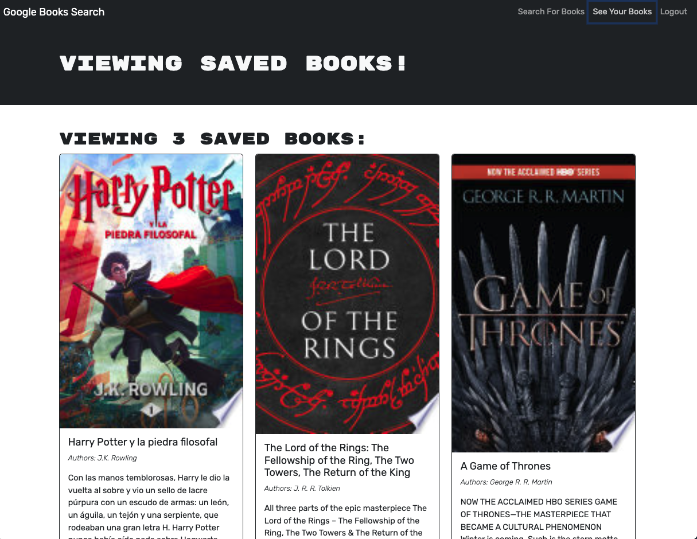

# find-your-book
## Description
This project is a book search engine where an user could find the desired book, having the options to save it to their profile and remove it later. This code is particularly special since it was refractored from a perfectly functioning Google Books API serch engine built with a RESTful API, into a GraphQL API built with Apollo Server. 

## Screenshots

## Link
https://find-your-book-dr65.onrender.com/

## Technologies
The technologies used in this project are `MERN` stack with a `React` front end, `MongoDB database`, and `Node.js/Express.js` server and `Restful API`, that was later refratctored to `GraphQL API`. To install all technologies and dependencies, please run `npm i` in your terminal.

## Usage
This search engine allows users to search for any book on the Google Books API, and to save them to their collection, which can only occur if the person is logged in. After logging in or creating an account, the pre saved books will appear in the 'See Your Books' section, with the option to delete them from the collection.

## Credits
I was able to create this code thanks to the help of the TA, tutors and old codes that were given to us as learning tools.

## License
The repository was created without a license.